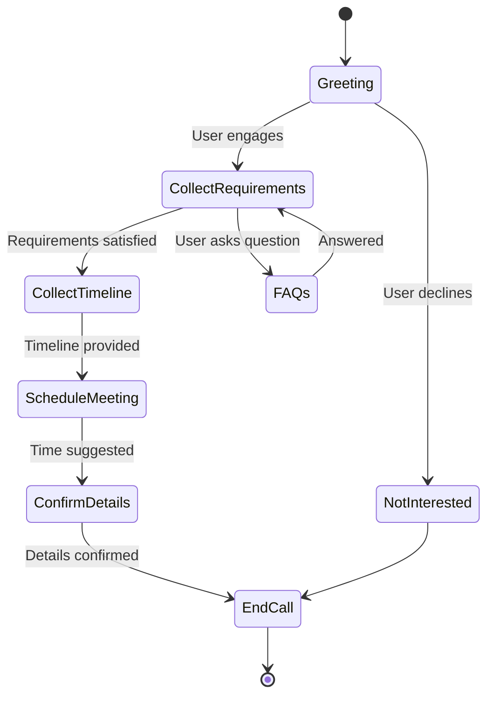

# Vaani — Real-Time AI Voice Agent Platform

## Overview
Vaani is a real-time AI voice platform for building outbound conversational agents over traditional phone networks. It combines streaming speech recognition, large language models, deterministic conversation management, and speech synthesis into a low-latency voice pipeline capable of handling interruptions, qualifying leads, and automating customer conversations.

### Key Capabilities
- Real-time outbound AI voice conversations
- Streaming speech recognition and synthesis
- Smart interruption handling
- Deterministic conversation management
- Structured lead qualification
- AI-powered post-call lead extraction
- SQLite persistence
- Performance and latency instrumentation

## Demo

A short walkthrough of the complete voice agent is available below.

**Loom Demo:** <I'll add my Loom link here>

## Features

### Voice Infrastructure
- **Real-time Voice Streaming:** Real-time audio streaming over WebSockets.
- **Streaming Speech-to-Text & Text-to-Speech:** Continuous stream processing for minimal conversational delay.
- **Smart Turn Endpointing:** ML-based Voice Activity Detection (VAD) for natural conversational turn-taking.
- **Interruption Handling:** Actively detects and gracefully responds to user interruptions at runtime.

### Conversation Intelligence
- **Dynamic State Management:** Maintains runtime conversation state and extracts typed slots.
- **Deterministic ConversationManager:** Enforces state transitions via hardcoded business logic rather than pure LLM inference.
- **Runtime Objective Switching:** Automatically adjusts the conversation trajectory toward business goals.
- **Dynamic Prompt Updates:** System instructions are updated in-place per turn, eliminating context window bloat.
- **Function-Calling Architecture:** Structured tool usage for reliable data collection.

### Lead Qualification
- Collects and validates conversational requirements.
- Extracts timelines and project metadata.
- Offers meeting scheduling and confirms appointment details.
- Contextually answers user FAQs before returning to the active workflow.

### Persistence
- Reconstructs complete conversation transcripts from context arrays.
- Persists lead records and transcripts into a SQLite database.

### Observability & Performance
- Turn-by-turn latency breakdown logging.
- Tool execution timing and fallback tracking.
- Token and LLM usage metrics.
- Extractor confidence scoring.

## System Architecture

The architecture isolates the deterministic business logic from the generative LLM pipeline, ensuring predictable transitions and safety.

```text
+-----------------------+       +-------------------------+       +-----------------------+
|  Telephony / Client   |       |       Pipeline          |       |    Business Logic     |
|                       |       |                         |       |                       |
|   [Twilio WebRTC]     |<=====>|   [Transport Layer]     |       |                       |
+-----------------------+       +-----------+-------------+       +-----------------------+
                                            |
                                            v
                                +-----------+-------------+       +-----------------------+
                                |      [Sarvam STT]       |       | [ConversationManager] |
                                +-----------+-------------+       |    - State Store      |
                                            |                     |    - Objectives       |
                                            v                     |    - Slot Validation  |
                                +-----------+-------------+       +-----------^-----------+
                                |  [Context Aggregator]   |<==================|
                                +-----------+-------------+       +-----------v-----------+
                                            |                     |    [LLM Functions]    |
                                            v                     |    - update_state     |
                                +-----------+-------------+       +-----------^-----------+
                                |   [Pre-LLM Extractor]   |                   |
                                +-----------+-------------+                   |
                                            |                                 |
                                            v                                 |
                                +-----------+-------------+                   |
                                |       [Groq LLM]        |===================+
                                +-----------+-------------+
                                            |
                                            v
                                +-----------+-------------+
                                |      [Sarvam TTS]       |
                                +-------------------------+
```

## Technology Stack

| Layer | Technology |
|-------|------------|
| Backend | FastAPI |
| Voice Pipeline | Pipecat |
| Telephony | Twilio Media Streams |
| LLM | Groq (Llama 3.3 70B) |
| Speech Recognition | Sarvam STT |
| Speech Synthesis | Sarvam TTS |
| Database | SQLite |

## Conversation Flow



## Lead Extraction Example

Post-call, the system processes the transcript to extract a structured JSON object containing validated slots and a concise summary.

```json
{
  "project_type": "5 BHK Apartment",
  "timeline": "Within one month",
  "meeting_booked": true,
  "meeting_time": "Tomorrow 3:00 PM",
  "summary": "Customer is planning a renovation and requested a consultation."
}
```

## Project Structure

```text
vaani-voice-agent/
├── README.md
├── frontend/
└── backend/
    ├── main.py
    ├── conversation_manager.py
    ├── extraction.py
    ├── db.py
    ├── voice/
    ├── prompts/
    ├── tests/
    └── requirements.txt
```

## Installation

1. **Clone the repository:**
   ```bash
   git clone https://github.com/yourusername/vaani-voice-agent.git
   cd vaani-voice-agent/backend
   ```

2. **Create a virtual environment and install dependencies:**
   ```bash
   python -m venv venv
   source venv/bin/activate  # On Windows: venv\Scripts\activate
   pip install -r requirements.txt
   ```

3. **Initialize the database:**
   The SQLite database (`vaani.db`) will be automatically created on the first run.

## Environment Variables (.env.example)

Create a `.env` (or `.env.example`) file in the `backend/` directory based on this template:

```env
# Server Configuration
PORT=8000
HOST=0.0.0.0

# API Keys
GROQ_API_KEY=your_groq_api_key_here
SARVAM_API_KEY=your_sarvam_api_key_here

# Telephony (Optional, if integrating with Twilio)
TWILIO_ACCOUNT_SID=your_twilio_account_sid
TWILIO_AUTH_TOKEN=your_twilio_auth_token
```

## Running the Project

1. **Start the FastAPI server:**
   ```bash
   cd backend
   uvicorn main:app --host 0.0.0.0 --port 8000 --reload
   ```

2. **Connect a Telephony Client:**
   Route incoming Twilio voice calls via WebSocket to `wss://yourdomain.com/ws`.

3. **Run E2E Tests (Local Pipeline Verification):**
   ```bash
   python test_e2e.py
   ```

## Future Improvements

- CRM integrations (HubSpot, Salesforce)
- Google Calendar / Outlook scheduling
- RAG-powered business knowledge
- SIP support
- Analytics dashboard
- Multi-agent workflows
- Additional language support

## License

This project is licensed under the MIT License. See the LICENSE file for details.
